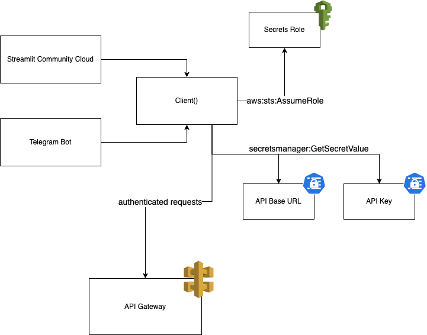

# shared

This module contains the Models that tie together the different Clients and the Backend.
It additionally contains functionality that is shared between all types of Clients, like the asynchronous HTTP Client,
response rendering functionality and AWS authentication.

## Models

## Client

The HTTP Client is the main component that the frontends use to communicate with the backends.
It defines a unified behaviour in regard to backend responses, such as 200, 400 and 500 status codes with different
error messages.

Additionally, it provides an authentication flow against AWS, given an external ID, to fetch secrets required to
authenticate against API Gateway. The authentication flow is outlined below.

<figure>

</figure>

Since I don't own a domain right now, this enables full functionality of the client by sharing just one secret – the
external id – instead of the API Key and the URL of each stage manually (as the Stage ID may be subject to change
with IAC).